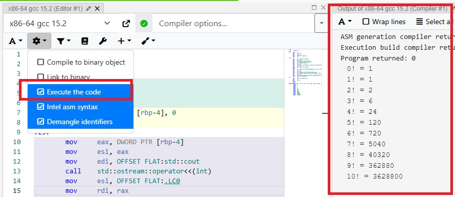

my-polyu-cpp-metaprogramming-talk-materials
===========================================
### Online IDE
- [godbolt.org - Compiler Explorer](https://godbolt.org/)
  - To execute code:
    - 

### Compile-time factorial function in different C++ version
- Classic C-style C++ (not recommended)
  - [sample code using C's macro](./Classic/factorial/version-1/main.cpp)
- C++11
  - [sample code using variadic `template`](./Cpp11/factorial/version-1/main.cpp)
- C++17 ([how to enable C++17 on godbolt.org](/images/how-to-enable-cpp17-on-godbolt.jpg))
  - [sample code using `constexpr`](./Cpp17/factorial/version-1/main.cpp)
- C++20 ([how to enable C++20 on godbolt.org](/images/how-to-enable-cpp20-on-godbolt.jpg))
  - [sample code using `consteval` with `constexpr`](./Cpp20/factorial/version-1/main.cpp)

### C++20 `concept`
- [sample code](./Cpp20/concept/main.cpp)

### Recommended books can be borrowed in PolyU library
- [C++ templates : the complete guide (ebook)](https://julac-hkpu.primo.exlibrisgroup.com/permalink/852JULAC_HKPU/10nha58/cdi_askewsholts_vlebooks_9780134778747)
  - Chinese translated version: [C++ Templates 全覽](https://julac-hkpu.primo.exlibrisgroup.com/permalink/852JULAC_HKPU/1o0v2av/alma991022367859103411)
